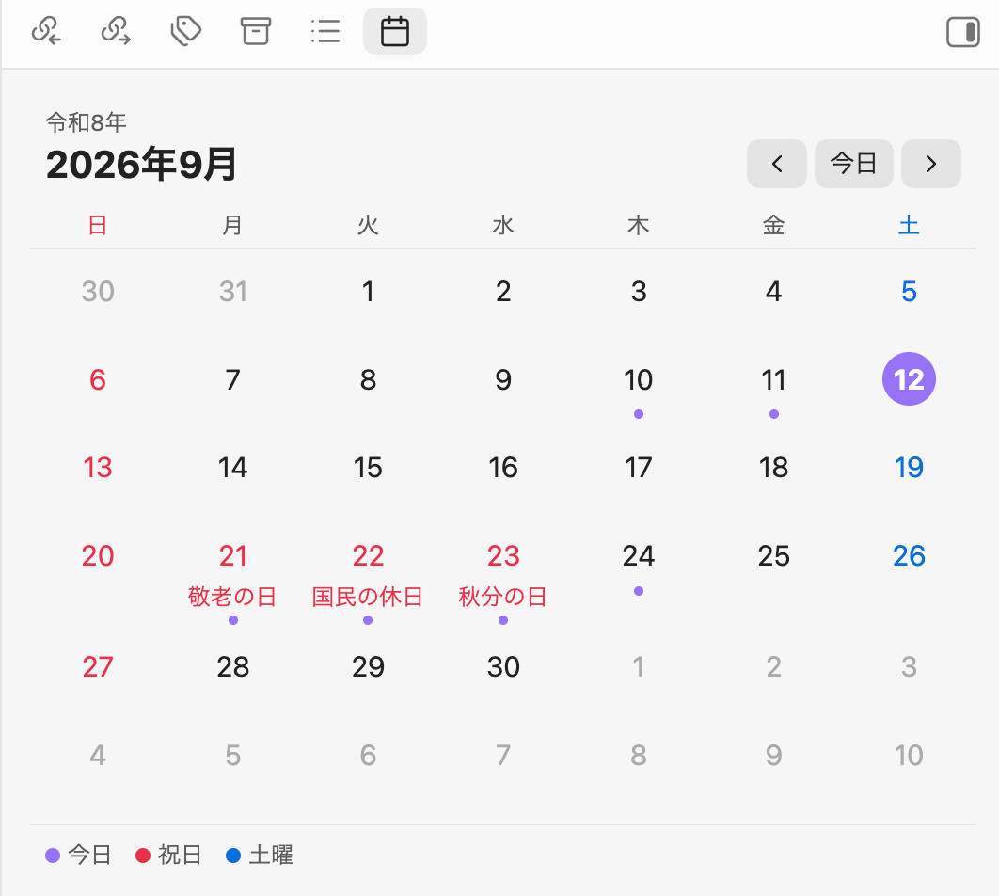
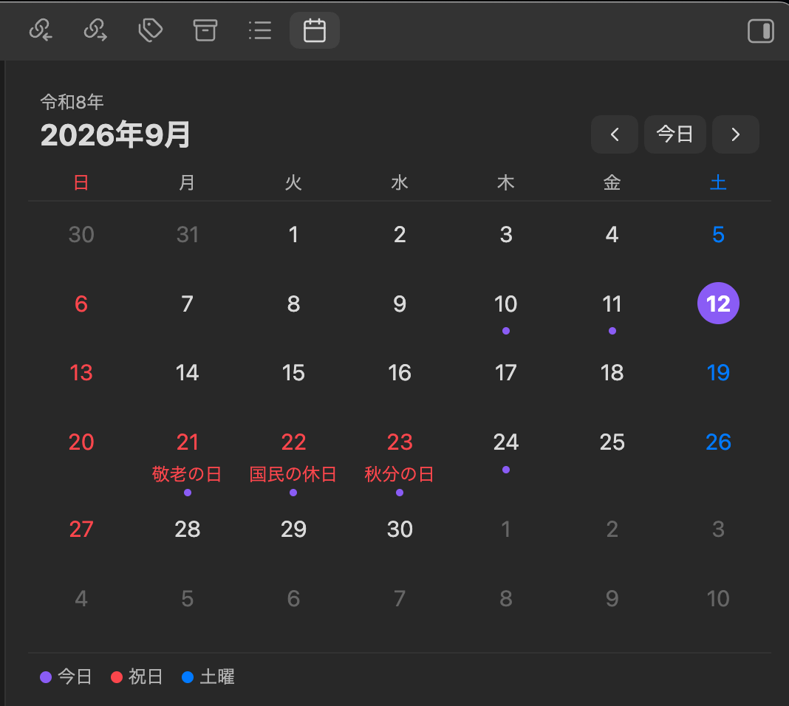

# Japanese Holiday Calendar

An [Obsidian](https://obsidian.md) plugin that shows a month calendar with Japanese public holidays (国民の祝日) in the sidebar. Select a date to open its daily note.

[日本語の説明はこちら](#日本語)

<p align="center">
  
  
</p>

## Features

- Month view in the right sidebar with Japanese public holidays highlighted in red, including substitute holidays (振替休日) and citizens' holidays (国民の休日)
- Holiday names shown under each date
- Japanese era year (for example 令和8年) above the month
- Sundays in red, Saturdays in blue, today highlighted
- A dot under dates that already have a daily note; hover to preview it
- Select a date to open its daily note — it is created from your daily note template if it does not exist yet (Cmd/Ctrl-click opens it in a new tab)
- Works with the core **Daily notes** plugin and with **Periodic Notes**
- Holidays are computed locally from the National Holidays Act. No network access, no external data

## Usage

1. Enable the core **Daily notes** plugin (**Settings → Core plugins**) and set its folder, format and template as you like.
2. Open the calendar with the ribbon icon or the command **Japanese Holiday Calendar: Open calendar**.
3. Use `‹` / `›` to move between months and **Today** to jump back.

## Settings

| Setting | Description |
| --- | --- |
| Start week on | Sunday or Monday in the first column |
| Show holiday names | Show the holiday name under the date |
| Show Japanese era | Show the era year above the month |
| Show legend | Show the color legend below the calendar |
| Confirm before creating a daily note | Ask before creating a note for a date that has none |

The calendar follows the app language: labels are in Japanese when Obsidian's language is Japanese, otherwise in English. Holiday names are always in Japanese.

## Installation

### From the community plugin list

Search for **Japanese Holiday Calendar** in **Settings → Community plugins → Browse**.

### Manual

1. Download `main.js`, `manifest.json` and `styles.css` from the [latest release](https://github.com/e8dev-note/japanese-holiday-calendar/releases/latest).
2. Copy them into `<your vault>/.obsidian/plugins/japanese-holiday-calendar/`.
3. Reload Obsidian and enable the plugin in **Settings → Community plugins**.

## Development

```bash
npm install
npm run dev     # watch build
npm run build   # production build
npm test        # holiday calculation tests
npm run lint
```

## License

MIT

---

## 日本語

Obsidianのサイドバーに、日本の祝日入りの月間カレンダーを表示するプラグインです。日付を押すとその日のデイリーノートを開きます（なければテンプレートから作成します）。

### 機能

- 祝日を赤で表示（振替休日・国民の休日にも対応）し、日付の下に祝日名を表示
- 和暦（例: 令和8年）を月の上に表示
- 日曜は赤、土曜は青、今日は強調表示
- デイリーノートがある日には点を表示。ホバーでプレビュー
- 日付を押すとデイリーノートを開く／作成（Cmd/Ctrl+クリックで新しいタブ）
- コアプラグイン「デイリーノート」と Periodic Notes の両方に対応
- 祝日は祝日法に基づいてローカルで計算。通信や外部データは不要

### 使い方

1. コアプラグイン「デイリーノート」を有効にし、フォルダ・日付書式・テンプレートを設定します。
2. リボンのカレンダーアイコン、またはコマンド **Japanese Holiday Calendar: Open calendar** でカレンダーを開きます。
3. `‹` `›` で月を移動、「今日」で今月に戻ります。

### 予定

- 一粒万倍日・不成就日などの暦注の表示（v1.1）
